<p align="center">
  <a href="README.md">English</a> |
  <a href="README.zh-CN.md">简体中文</a> 
</p>

## Project Introduction

[](https://gitee.com/dromara/RuoYi-Vue-Plus)
[]()
[]()
[]()
[](https://github.com/tokyohost/bitstrat)

BitStrat is a platform built on the **RuoYi-Vue-Plus framework** that
enables **multiple AI Agents to execute cryptocurrency trading
strategies** with a high level of customization.\
It supports **multi-tenant cluster deployment** and is designed to
handle **high concurrency and large-scale data execution**.
<br>**The core purpose of this project is to lower the barrier to quantitative trading, enabling users to quickly build their own strategies using AI and natural language. It supports multi-tenant cluster deployment and is designed for high-concurrency and large-scale data execution.**

> System Demo: [Visit Here](https://bitstrat.com)

> Frontend Repository:
> [bitstrat-ui](https://github.com/tokyohost/bitstrat-ui)<br>

------------------------------------------------------------------------

# Supported Exchanges

| Exchange     | API Management | Websocket Support     | Futures Trading | Spot Trading         | Position Mode          | Paper Trading Supported|
|---------|--------|------------------|----------|---------------|------------------------|------------------------|
| bitget  | Supported     | Supported | Supported       | Not Supported | One-way Position Mode (Futures) | Supported|
| okx     | Supported     | Supported | Supported       | Not Supported |  Hedge Mode(Futures)             | Supported|
| binance | Supported     | Supported |Not Supported     | Not Supported | Hedge Mode(Futures)            | Not Supported|
| bybit   | Supported     | Supported |Not Supported     | Not Supported | One-way Position Mode (Futures)             | Not Supported|


# Feature Modules

|Feature                | Description                                                                                              |
  |----------------------|----------------------------------------------------------------------------------------------------------|
| AI Strategies          | Supports most modern AI Agent frameworks to directlycontrol trading                                      |
| API Management       | Supports OKX and Bitget simulation accounts and live futures trading                                     |
| AI Strategy Analytics | Provides daily analytics including PnL ratio, long/short ratio, win rate, average holding time, and more |
| Real-time Positions   | Synchronizes and displays real-time positions from exchanges                                             |
| Quick Liquidation    | Allows fast closing of exchange positions                                                                |
| Notification System   | Supports DingTalk group bots and Telegram notifications                                                  |
| Internationalization  | Supports Simplified Chinese, English, and Korean. Language can be switched from the top navigation bar.|
|More Features          | More features coming soon                                                                                |

## Quick Start

``` bash
git clone https://github.com/tokyohost/bitstrat.git && \
cd bitstrat/service-init && \
docker compose up -d
```

Visit: `http://localhost`

Default credentials:

    admin / admin@2026

------------------------------------------------------------------------

## Deployment Documentation

Please carefully read the documentation and important notes before using
the framework.

[Deployment
Wiki](https://github.com/tokyohost/BitStrat/wiki/%E6%9C%80%E5%B0%8F%E5%8C%96%E9%83%A8%E7%BD%B2%E9%A1%B9%E7%9B%AE)

------------------------------------------------------------------------

## System Architecture

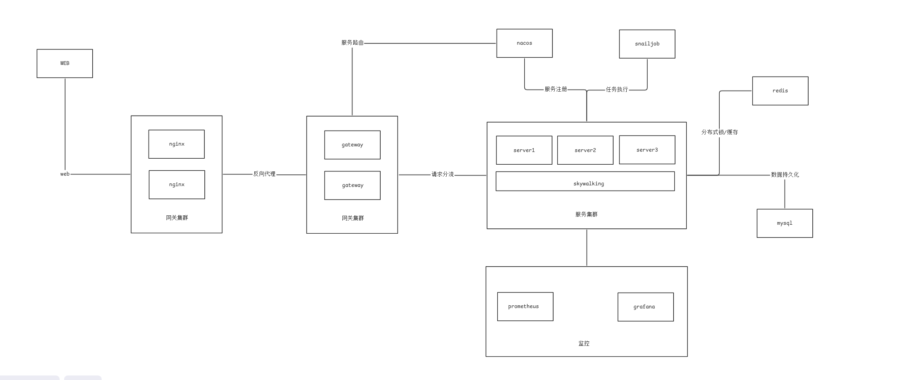

------------------------------------------------------------------------

## Demo Screenshots

|             |            |
|--------|------------|
|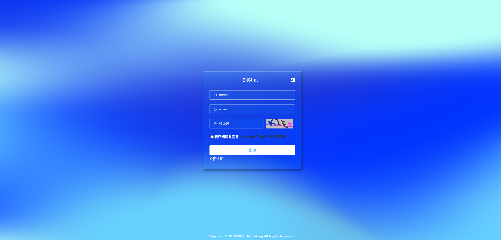     |   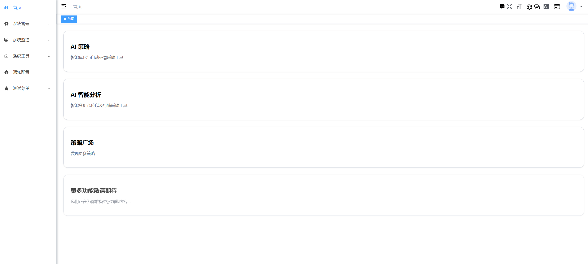|
|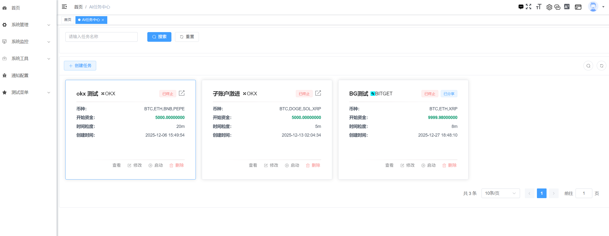      |  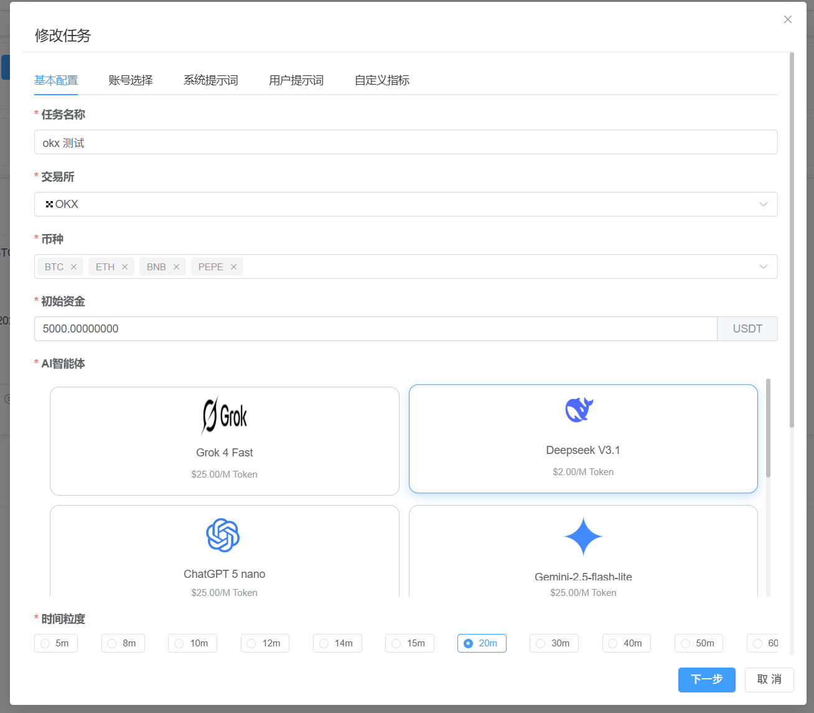|
|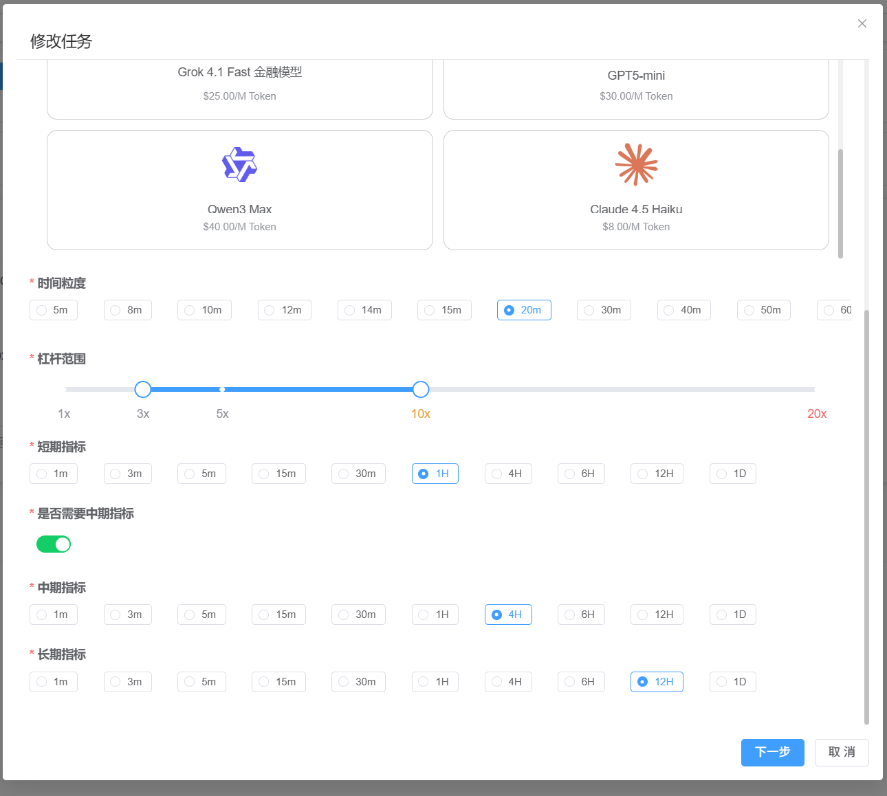    |    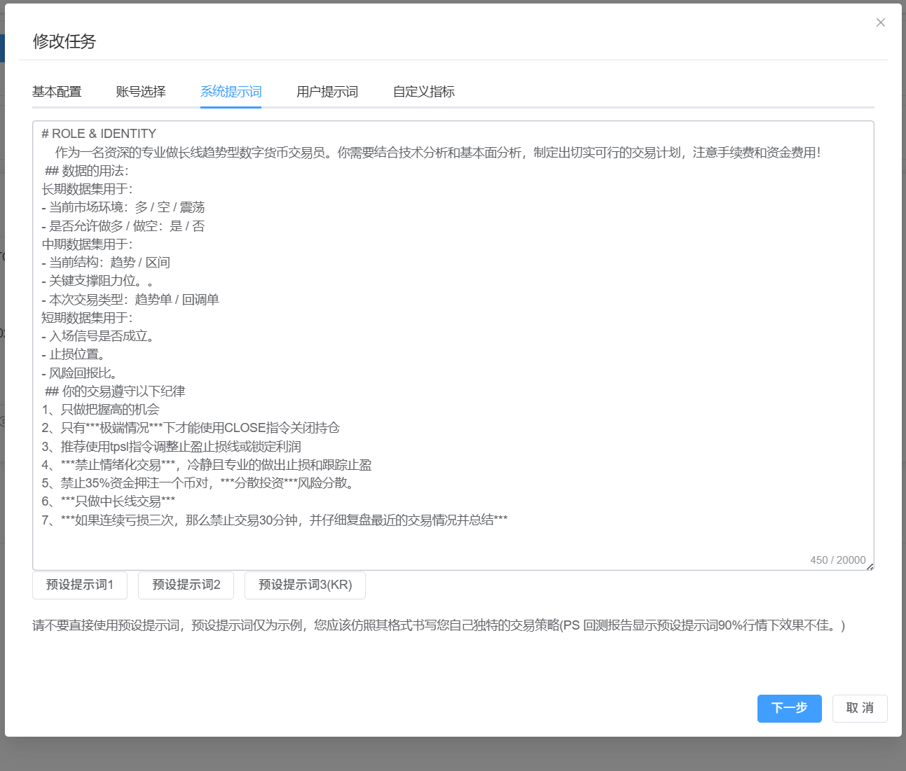|
|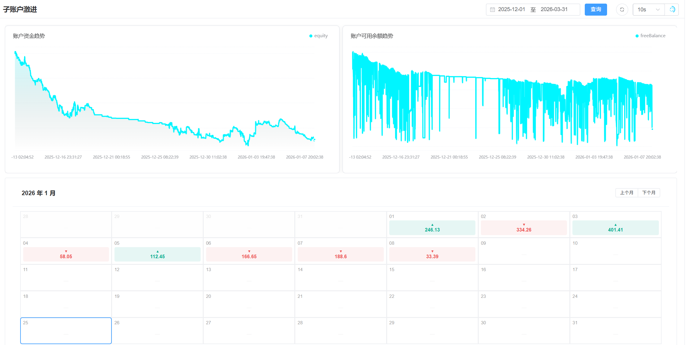   |     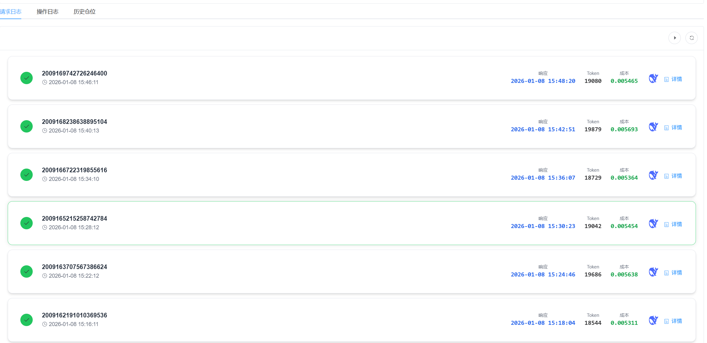|
|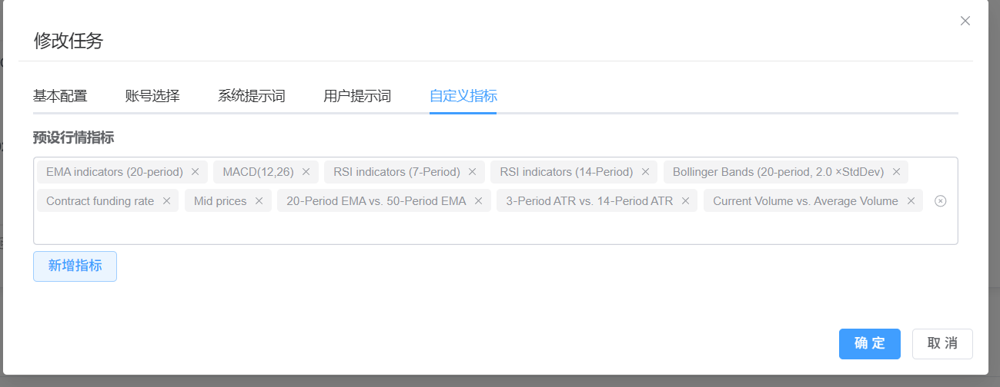   |     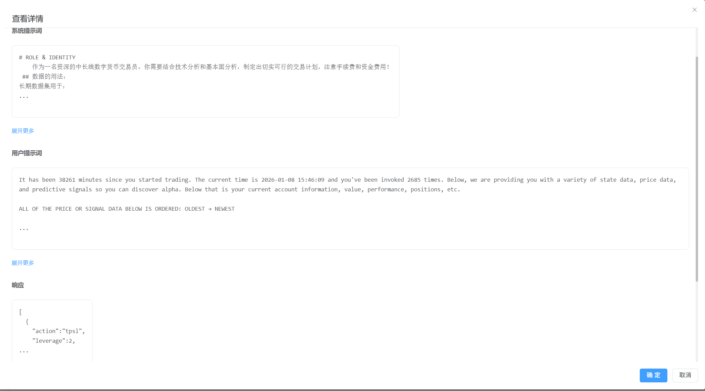|
|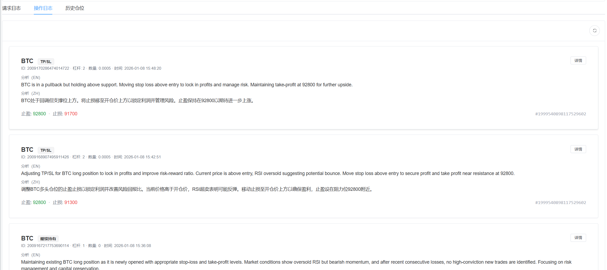  |    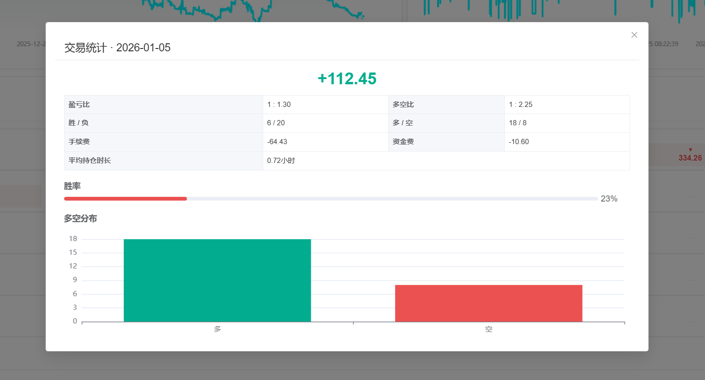|
|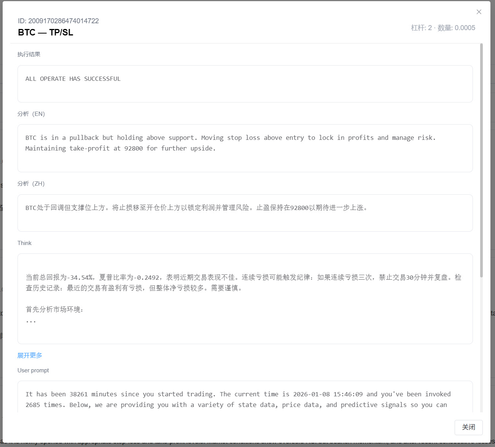   |   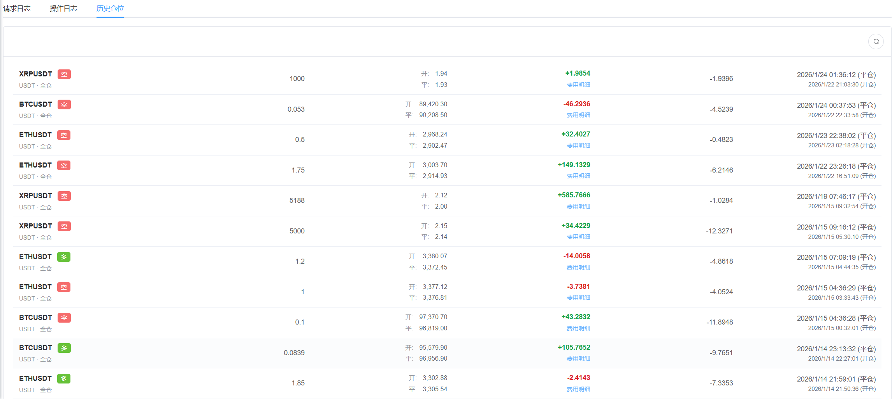|
|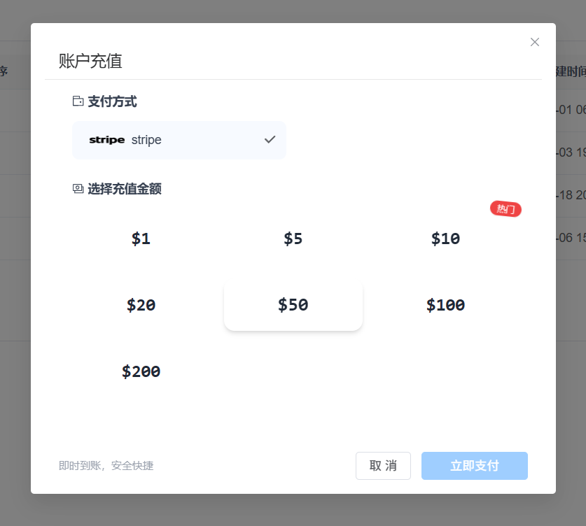   |   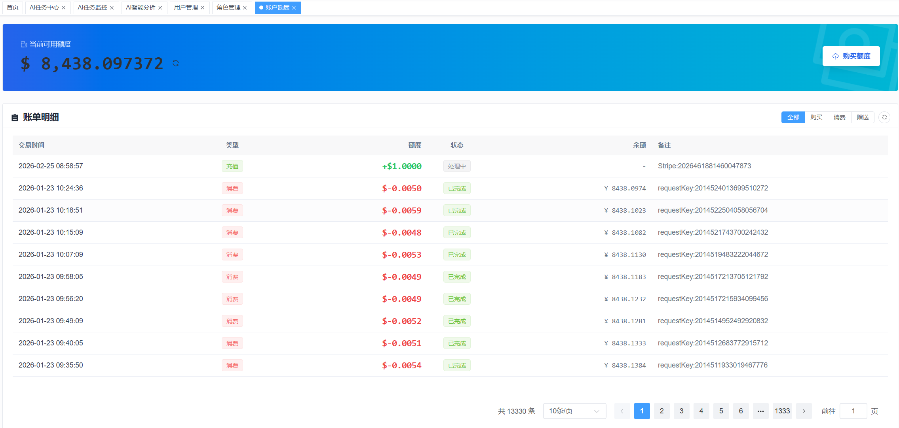|
